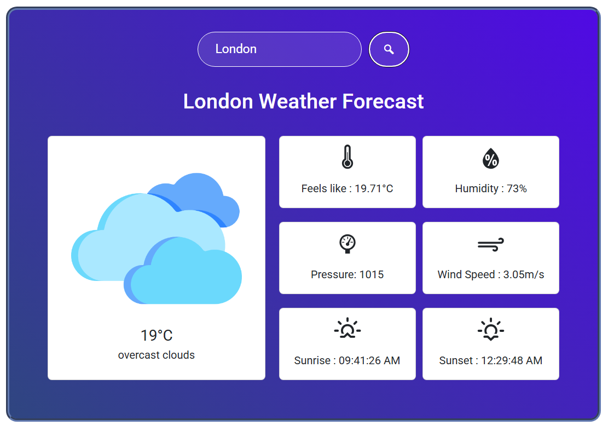

# React Weather App

A simple and modern weather application built with React. This app allows users to search for current weather conditions in any city worldwide using real-time data from a public weather API.

## Features

- 🌤️ **Current Weather:** View up-to-date weather conditions for any city.
- 🔍 **City Search:** Search for cities using a responsive search bar.
- 🖼️ **Dynamic UI:** Weather icons and backgrounds change based on current conditions.
- 💻 **Responsive Design:** Works great on desktop and mobile devices.

## Demo



## Getting Started

### Prerequisites

- [Node.js](https://nodejs.org/) (v16 or newer recommended)
- [npm](https://www.npmjs.com/) or [yarn](https://yarnpkg.com/)

### Installation

1. **Clone the repository:**

   ```bash
   git clone https://github.com/samrahm/react-weather-app.git
   cd react-weather-app
   ```

2. **Install dependencies:**

   ```bash
   npm install
   # or
   yarn install
   ```

3. **Set up API Key:**

   - This app uses [OpenWeatherMap](https://openweathermap.org/) or a similar API.
   - Create a free account and get your API key.
   - Create a `.env` file in the root directory and add:
     ```
     REACT_APP_WEATHER_API_KEY=your_api_key_here
     ```

4. **Start the app:**

   ```bash
   npm start
   # or
   yarn start
   ```

5. **Visit** [http://localhost:5173](http://localhost:5173) in your browser.

## Configuration

- To change the default units, update the state in the app or modify the relevant environment variable (if supported).
- API endpoint can be configured in the source code or via `.env` as needed.

## Project Structure

```
react-weather-app/
├── public/
├── src/
│   ├── components/
│   ├── App.js
│   └── index.js
├── package.json
└── README.md
```

## Technologies Used

- [React](https://react.dev/)
- [Axios](https://axios-http.com/) (for API requests)
- [OpenWeatherMap API](https://openweathermap.org/api)
- [React Context API](https://react.dev/reference/react/useContext) (for state management)
- CSS/SCSS Modules (for styling)

  ## Modifications

- 📍 **Geolocation:** Optionally detect and display weather for your current location.
- 🌡️ **Temperature Units:** Toggle between Celsius and Fahrenheit.

## Contributing

Contributions are welcome! Please open an issue or a pull request to discuss improvements or bug fixes.

1. Fork the repository
2. Create a new branch: `git checkout -b feature/your-feature`
3. Commit your changes: `git commit -m "Add your feature"`
4. Push to the branch: `git push origin feature/your-feature`
5. Open a pull request

---
